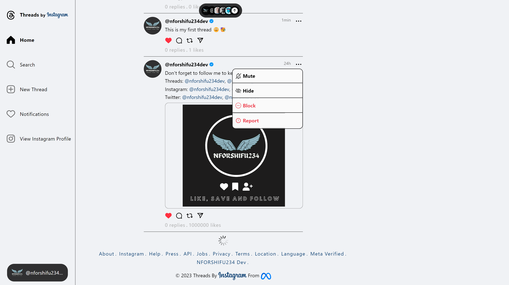

<h1 align="center">Threads App inspired by Instagram Web version by NFORSHIFU234 Dev || Shifu-Nfor Nyuiring-yoh Rhagninyui </h1>

This is a project that I made/created to test my front end skills in HTML CSS and JavaScript. I also was learning how "SCSS" works.   

The Live Page for this project is:   
The GitHub Respository for this project is: 

    The idea for this project came to mind on the 09th July, 2023 annd then I took it to bring something similar to reality and on the 16th July, 2023, the project was complete except for a specific bug which was videos were not playing automatically on IPhone as users scroll the page except they had to click on the video before it played.

You can visit the scribe tutorial using the link <a href='https://scribehow.com/shared/Visual_Tutorial_on_My_Web_Version_of_Threads_App_Using_HTML_CSS_and_JavaScript_inspired_by_Instagram_Web_Layout__hkxZGq8kScGyqBn_LXyFmw '>https://scribehow.com/shared/Visual_Tutorial_on_My_Web_Version_of_Threads_App_Using_HTML_CSS_and_JavaScript_inspired_by_Instagram_Web_Layout__hkxZGq8kScGyqBn_LXyFmw </a>

<h1 align="center" style="color:red;font-weight:bold;text-transform: uppercase;" >NOTE:  This project has no partnership with either <b>Instagram.com</b>, <b>Threads.net</b> or any Services from Meta </h1>

<h2 class="titleNum" style="display:flex;">
Version 1.0.0

<svg xmlns="http://www.w3.org/2000/svg" style="margin-left: 5px;" width="16" height="16" fill="rgb( 88, 195, 34 )" class="bi bi-clock-history" viewBox="0 0 16 16"><path d="M8.515 1.019A7 7 0 0 0 8 1V0a8 8 0 0 1 .589.022l-.074.997zm2.004.45a7.003 7.003 0 0 0-.985-.299l.219-.976c.383.086.76.2 1.126.342l-.36.933zm1.37.71a7.01 7.01 0 0 0-.439-.27l.493-.87a8.025 8.025 0 0 1 .979.654l-.615.789a6.996 6.996 0 0 0-.418-.302zm1.834 1.79a6.99 6.99 0 0 0-.653-.796l.724-.69c.27.285.52.59.747.91l-.818.576zm.744 1.352a7.08 7.08 0 0 0-.214-.468l.893-.45a7.976 7.976 0 0 1 .45 1.088l-.95.313a7.023 7.023 0 0 0-.179-.483zm.53 2.507a6.991 6.991 0 0 0-.1-1.025l.985-.17c.067.386.106.778.116 1.17l-1 .025zm-.131 1.538c.033-.17.06-.339.081-.51l.993.123a7.957 7.957 0 0 1-.23 1.155l-.964-.267c.046-.165.086-.332.12-.501zm-.952 2.379c.184-.29.346-.594.486-.908l.914.405c-.16.36-.345.706-.555 1.038l-.845-.535zm-.964 1.205c.122-.122.239-.248.35-.378l.758.653a8.073 8.073 0 0 1-.401.432l-.707-.707z"></path><path d="M8 1a7 7 0 1 0 4.95 11.95l.707.707A8.001 8.001 0 1 1 8 0v1z"></path><path d="M7.5 3a.5.5 0 0 1 .5.5v5.21l3.248 1.856a.5.5 0 0 1-.496.868l-3.5-2A.5.5 0 0 1 7 9V3.5a.5.5 0 0 1 .5-.5z"></path></svg><svg aria-label="Latest Version" class="x1lliihq x1n2onr6 Latest Version" fill="rgb( 88, 195, 34 )" style="margin-left: 5px;" height="20" role="img" viewBox="0 0 40 40" width="20"><title>Latest Version</title><path d="M19.998 3.094 14.638 0l-2.972 5.15H5.432v6.354L0 14.64 3.094 20 0 25.359l5.432 3.137v5.905h5.975L14.638 40l5.36-3.094L25.358 40l3.232-5.6h6.162v-6.01L40 25.359 36.905 20 40 14.641l-5.248-3.03v-6.46h-6.419L25.358 0l-5.36 3.094Zm7.415 11.225 2.254 2.287-11.43 11.5-6.835-6.93 2.244-2.258 4.587 4.581 9.18-9.18Z" fill-rule="evenodd"></path></svg></h2>

<ul>

<li>
<h3>Responive Layout</h3>

This project has a responsive layout which works on almost all devices. If it does not look well on your website, send me a feedback via any of my social media accounts.

</li>

<li>
<h3>Swipe between medias</h3>

In this project, if a thread has more than 1 media, then you can either swipe through it or you can just use the arrow buttons.

</li>

<li>
<h3>Autplay videos on scroll</h3>

In this project, as you scroll down and view a Thread with a video, if you have reacted with any element on this page, then you have autoplay for videos enabled and the video will play automatically.
Else there will be a play button which you use and play the video. And once you scroll past the video, and the video was still playing the video gets paused.

</li>

<li>
<h3>Play video again</h3>

In this project, there is the option of play video again. Here when a video has finshed playing, a popover will appear on top of the video with a Play Again button. Also if the video is finshed and you scroll 
up or down, once you come back to that video, it will start playing again from start.

</li>

<li>
<h3>Mute and Unmute a video</h3>

In this project, for each Thread that has a video, there is a speaker icon on the bottom right of the video container. 
This helps to mute and unmute each video. 

</li>

<li>
<h3>Like a Thread</h3>

In this project, you can like and unlike each Thread and also when you like or unlike a thread, the number of likes counter will increase or decrease by 1.

</li>

<li>
<h3>Toggle menu of each Thread post</h3>

In this project, each Thread has a menu and each Thread has menu icon that is at the top right of each Thread. 
So if you click on that menu icon, then the menu will show up and if you click on the icon again or any of the options in the menu then menu is hidden.

</li>

<li>
<h3>Scroll to the top</h3>

In this project, when you scroll the page and you are getting to the bottom, at the middle of the Feed section, you will see a button which looks like new Threads were fetched. But it just actually scrolls you back to the top when you click on it.

</li>

</ul>

# Inspiration

The design for this project was brought by 2 applications which were Thread & Instagram.

# Languages Used

The languages I used to build this project were,

<ul>

<li>  HTML5 </li>
<li>  CSS3 </li>
<li>  Vanilla JS </li>

</ul>

# Icons, Images, Videos, Usernames Used

<ul>

<li>  Almost all Icons were gotten from Instagram.com.  </li>
<li> All the videos used in this site were gotten from Instagram.com</li>
<li> All the usernames used here are usernames gotten from Instagram.com</li>
<li> Almost all Images were gotten from Instagram.com</li>
<li> Some Images may belong to NFORSHIFU234 Dev</li>

</ul>

# Font Used

<ul>

<li>  The font used was the default font used by Instagram.  </li>

</ul>

## Screenshots

## Loading Page

## Mobile View

## Tablet View

## Desktop View

# Feedback

I would love to hear what you think about this project 🥲. If you want to give a feedback about this project,
you can reach me through any of the mediums below:  

<ul style="margin-left: 10px;">

<li style="margin-bottom: 10px;">
<h3>
<svg aria-label="Instagram" class="x1lliihq x1n2onr6" color="rgb(243, 245, 247)" fill="rgb(181 182 184)" height="24" role="img" viewBox="0 0 24 24" width="24"><title>Instagram</title><path d="M12 2.982c2.937 0 3.285.011 4.445.064a6.087 6.087 0 0 1 2.042.379 3.408 3.408 0 0 1 1.265.823 3.408 3.408 0 0 1 .823 1.265 6.087 6.087 0 0 1 .379 2.042c.053 1.16.064 1.508.064 4.445s-.011 3.285-.064 4.445a6.087 6.087 0 0 1-.379 2.042 3.643 3.643 0 0 1-2.088 2.088 6.087 6.087 0 0 1-2.042.379c-1.16.053-1.508.064-4.445.064s-3.285-.011-4.445-.064a6.087 6.087 0 0 1-2.043-.379 3.408 3.408 0 0 1-1.264-.823 3.408 3.408 0 0 1-.823-1.265 6.087 6.087 0 0 1-.379-2.042c-.053-1.16-.064-1.508-.064-4.445s.011-3.285.064-4.445a6.087 6.087 0 0 1 .379-2.042 3.408 3.408 0 0 1 .823-1.265 3.408 3.408 0 0 1 1.265-.823 6.087 6.087 0 0 1 2.042-.379c1.16-.053 1.508-.064 4.445-.064M12 1c-2.987 0-3.362.013-4.535.066a8.074 8.074 0 0 0-2.67.511 5.392 5.392 0 0 0-1.949 1.27 5.392 5.392 0 0 0-1.269 1.948 8.074 8.074 0 0 0-.51 2.67C1.012 8.638 1 9.013 1 12s.013 3.362.066 4.535a8.074 8.074 0 0 0 .511 2.67 5.392 5.392 0 0 0 1.27 1.949 5.392 5.392 0 0 0 1.948 1.269 8.074 8.074 0 0 0 2.67.51C8.638 22.988 9.013 23 12 23s3.362-.013 4.535-.066a8.074 8.074 0 0 0 2.67-.511 5.625 5.625 0 0 0 3.218-3.218 8.074 8.074 0 0 0 .51-2.67C22.988 15.362 23 14.987 23 12s-.013-3.362-.066-4.535a8.074 8.074 0 0 0-.511-2.67 5.392 5.392 0 0 0-1.27-1.949 5.392 5.392 0 0 0-1.948-1.269 8.074 8.074 0 0 0-2.67-.51C15.362 1.012 14.987 1 12 1Zm0 5.351A5.649 5.649 0 1 0 17.649 12 5.649 5.649 0 0 0 12 6.351Zm0 9.316A3.667 3.667 0 1 1 15.667 12 3.667 3.667 0 0 1 12 15.667Zm5.872-10.859a1.32 1.32 0 1 0 1.32 1.32 1.32 1.32 0 0 0-1.32-1.32Z"></path></svg>
Instagram:
</h3>
<a href="https://www.instagram.com/nforshifu234dev/" target="_blank" rel="noopener noreferrer">@nforshifudev</a> or
<a href="https://www.instagram.com/nforshifu_234/" target="_blank" rel="noopener noreferrer">@nforshifu_234</a> 
</li>

<li style="margin-bottom: 10px;">
<h3>
<svg aria-label="Threads" class="x1f0ztbi x129878i x1voqysh x1qjy6fj x3nhe6m xm7lytj x2qib4z x1ykpatu xcu9agk x9f619" fill="none" height="24" role="img" viewBox="0 0 192 192" width="24" xmlns="http://www.w3.org/2000/svg"><path d="M141.537 88.9883C140.71 88.5919 139.87 88.2104 139.019 87.8451C137.537 60.5382 122.616 44.905 97.5619 44.745C97.4484 44.7443 97.3355 44.7443 97.222 44.7443C82.2364 44.7443 69.7731 51.1409 62.102 62.7807L75.881 72.2328C81.6116 63.5383 90.6052 61.6848 97.2286 61.6848C97.3051 61.6848 97.3819 61.6848 97.4576 61.6855C105.707 61.7381 111.932 64.1366 115.961 68.814C118.893 72.2193 120.854 76.925 121.825 82.8638C114.511 81.6207 106.601 81.2385 98.145 81.7233C74.3247 83.0954 59.0111 96.9879 60.0396 116.292C60.5615 126.084 65.4397 134.508 73.775 140.011C80.8224 144.663 89.899 146.938 99.3323 146.423C111.79 145.74 121.563 140.987 128.381 132.296C133.559 125.696 136.834 117.143 138.28 106.366C144.217 109.949 148.617 114.664 151.047 120.332C155.179 129.967 155.42 145.8 142.501 158.708C131.182 170.016 117.576 174.908 97.0135 175.059C74.2042 174.89 56.9538 167.575 45.7381 153.317C35.2355 139.966 29.8077 120.682 29.6052 96C29.8077 71.3178 35.2355 52.0336 45.7381 38.6827C56.9538 24.4249 74.2039 17.11 97.0132 16.9405C119.988 17.1113 137.539 24.4614 149.184 38.788C154.894 45.8136 159.199 54.6488 162.037 64.9503L178.184 60.6422C174.744 47.9622 169.331 37.0357 161.965 27.974C147.036 9.60668 125.202 0.195148 97.0695 0H96.9569C68.8816 0.19447 47.2921 9.6418 32.7883 28.0793C19.8819 44.4864 13.2244 67.3157 13.0007 95.9325L13 96L13.0007 96.0675C13.2244 124.684 19.8819 147.514 32.7883 163.921C47.2921 182.358 68.8816 191.806 96.9569 192H97.0695C122.03 191.827 139.624 185.292 154.118 170.811C173.081 151.866 172.51 128.119 166.26 113.541C161.776 103.087 153.227 94.5962 141.537 88.9883ZM98.4405 129.507C88.0005 130.095 77.1544 125.409 76.6196 115.372C76.2232 107.93 81.9158 99.626 99.0812 98.6368C101.047 98.5234 102.976 98.468 104.871 98.468C111.106 98.468 116.939 99.0737 122.242 100.233C120.264 124.935 108.662 128.946 98.4405 129.507Z" fill="rgb(181 182 184)"></path></svg>
Threads:
</h3>
<a href="https://www.threads.net/@nforshifu234dev/" target="_blank" rel="noopener noreferrer">@nforshifudev</a> or
<a href="https://www.threads.net/@nforshifu_234/" target="_blank" rel="noopener noreferrer">@nforshifu_234</a> 
</li>

<li style="margin-bottom: 10px;">
<h3>
<svg xmlns="http://www.w3.org/2000/svg" data-name="Layer 1" height="24" fill="rgb(181 182 184)" viewBox="0 0 24 24"><path d="M22,5.8a8.49,8.49,0,0,1-2.36.64,4.13,4.13,0,0,0,1.81-2.27,8.21,8.21,0,0,1-2.61,1,4.1,4.1,0,0,0-7,3.74A11.64,11.64,0,0,1,3.39,4.62a4.16,4.16,0,0,0-.55,2.07A4.09,4.09,0,0,0,4.66,10.1,4.05,4.05,0,0,1,2.8,9.59v.05a4.1,4.1,0,0,0,3.3,4A3.93,3.93,0,0,1,5,13.81a4.9,4.9,0,0,1-.77-.07,4.11,4.11,0,0,0,3.83,2.84A8.22,8.22,0,0,1,3,18.34a7.93,7.93,0,0,1-1-.06,11.57,11.57,0,0,0,6.29,1.85A11.59,11.59,0,0,0,20,8.45c0-.17,0-.35,0-.53A8.43,8.43,0,0,0,22,5.8Z"></path></svg>
Twitter:
</h3>
<a href="https://www.twitter.com/nforshifu234dev/" target="_blank" rel="noopener noreferrer">@nforshifudev</a> or
<a href="https://www.twitter.com/nforshifu_234/" target="_blank" rel="noopener noreferrer">@nforshifu_234</a> 
</li>

<li style="margin-bottom: 10px;">
<h3>
<svg xmlns="http://www.w3.org/2000/svg" data-name="Layer 1" height="24" fill="rgb(181 182 184)" viewBox="0 0 24 24"><path d="M12,2.2467A10.00042,10.00042,0,0,0,8.83752,21.73419c.5.08752.6875-.21247.6875-.475,0-.23749-.01251-1.025-.01251-1.86249C7,19.85919,6.35,18.78423,6.15,18.22173A3.636,3.636,0,0,0,5.125,16.8092c-.35-.1875-.85-.65-.01251-.66248A2.00117,2.00117,0,0,1,6.65,17.17169a2.13742,2.13742,0,0,0,2.91248.825A2.10376,2.10376,0,0,1,10.2,16.65923c-2.225-.25-4.55-1.11254-4.55-4.9375a3.89187,3.89187,0,0,1,1.025-2.6875,3.59373,3.59373,0,0,1,.1-2.65s.83747-.26251,2.75,1.025a9.42747,9.42747,0,0,1,5,0c1.91248-1.3,2.75-1.025,2.75-1.025a3.59323,3.59323,0,0,1,.1,2.65,3.869,3.869,0,0,1,1.025,2.6875c0,3.83747-2.33752,4.6875-4.5625,4.9375a2.36814,2.36814,0,0,1,.675,1.85c0,1.33752-.01251,2.41248-.01251,2.75,0,.26251.1875.575.6875.475A10.0053,10.0053,0,0,0,12,2.2467Z"></path></svg>
Github:
</h3>
<a href="https://www.github.com/nforshifu234dev/" target="_blank" rel="noopener noreferrer">www.github.com/nforshifu234dev/</a> 
</li>

<li style="margin-bottom: 10px;">
<h3>
<svg xmlns="http://www.w3.org/2000/svg" data-name="Layer 1" height="24" fill="rgb(181 182 184)" viewBox="0 0 24 24"><path d="M20.47,2H3.53A1.45,1.45,0,0,0,2.06,3.43V20.57A1.45,1.45,0,0,0,3.53,22H20.47a1.45,1.45,0,0,0,1.47-1.43V3.43A1.45,1.45,0,0,0,20.47,2ZM8.09,18.74h-3v-9h3ZM6.59,8.48h0a1.56,1.56,0,1,1,0-3.12,1.57,1.57,0,1,1,0,3.12ZM18.91,18.74h-3V13.91c0-1.21-.43-2-1.52-2A1.65,1.65,0,0,0,12.85,13a2,2,0,0,0-.1.73v5h-3s0-8.18,0-9h3V11A3,3,0,0,1,15.46,9.5c2,0,3.45,1.29,3.45,4.06Z"></path></svg>
LinkedIn:
</h3>
<a href="https://www.linkedin.com/nforshifu234dev/" target="_blank" rel="noopener noreferrer">www.linkedin.com/nforshifu234dev/</a> 
</li>

</ul>

<h1 align="center" style="color:red;font-weight:bold;text-transform: uppercase;" >NOTE:  This project has no partnership with either <b>Instagram.com</b>, <b>Threads.net</b> or any Services from Meta </h1>